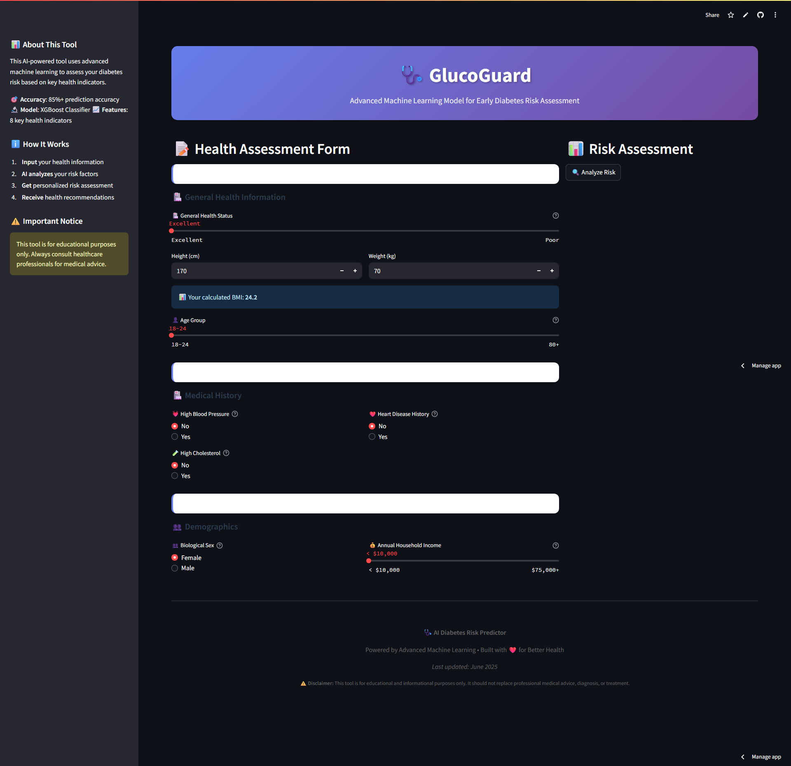

# 🩺 GlucoGuard – AI-Powered Diabetes Risk Predictor

**GlucoGuard** is a machine learning-powered web application that predicts an individual's risk of having diabetes (prediabetes or diabetes) based on key health indicators. Built with XGBoost, SHAP-based feature selection, and deployed using Streamlit, this tool empowers users with early awareness through predictive analytics.



## 🌐 Live Demo
🔗 [glucoguard.streamlit.app](https://glucoguard-app.streamlit.app) *(or your Streamlit URL)*

---

## 📊 Features

- 🧠 Trained on **BRFSS 2015 health indicators dataset** (Kaggle)
- ⚖️ Balanced classification between non-diabetic and diabetic respondents
- 🚀 Machine learning model: **XGBoost** with **hyperparameter tuning**
- 🔍 Feature selection using **SHAP values**
- 🎨 Modern UI with BMI calculator and demographic sliders
- 📈 Interactive **risk gauge** and **personalized recommendations**

---

## 📁 Project Structure

diabetes-risk-predictor/
│
├── app.py # Streamlit web app
├── final_xgb_diabetes_model.pkl # Trained XGBoost model
├── scaler_app.pkl # StandardScaler for selected features
├── requirements.txt # Python dependencies
├── README.md # This file
└── dataset/ # (Optional) Cleaned dataset (not pushed to GitHub)


---

## ⚙️ Installation & Run Locally

```bash
git clone https://github.com/yourusername/diabetes-risk-predictor.git
cd diabetes-risk-predictor
python -m venv venv
venv\Scripts\activate         # On Windows
# source venv/bin/activate    # On Mac/Linux
pip install -r requirements.txt
streamlit run app.py
```

📦 Dependencies
streamlit
xgboost
scikit-learn
numpy, pandas
plotly
joblib
Install via:
pip install -r requirements.txt

📚 Dataset
Dataset: Diabetes Health Indicators Dataset (BRFSS 2015)
Cleaned and preprocessed version: diabetes_binary_5050split_health_indicators_BRFSS2015.csv
Balanced classes: 0 = No diabetes, 1 = Prediabetes or diabetes

📈 Model Performance
Accuracy: ~75%
ROC AUC Score: 0.82
Model: XGBoost (with hyperparameter tuning via RandomizedSearchCV)
Features used: 8 SHAP-selected top predictors

🧪 Try It Yourself
Go to glucoguard-app.streamlit.app and:
Input your health data
View your diabetes risk prediction
Get personalized health advice and probability score
